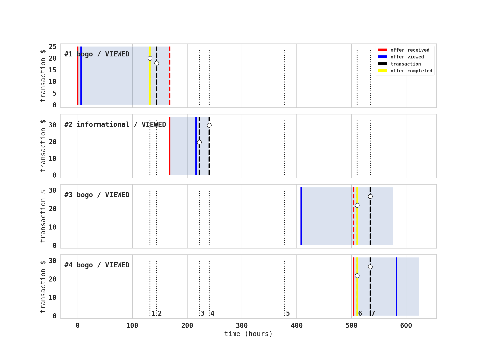
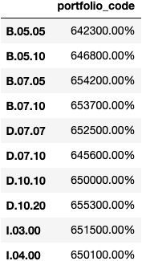
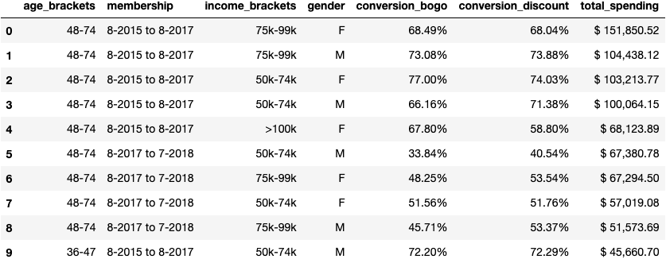

Photo by <a href="https://unsplash.com/@photographybyniels?utm_source=unsplash&amp;utm_medium=referral&amp;utm_content=creditCopyText">Niels Kehl</a> on <a href="https://unsplash.com/s/photos/starbucks?utm_source=unsplash&amp;utm_medium=referral&amp;utm_content=creditCopyText">Unsplash</a>

# __Background__

In the final project for my DataScience degree at [Udacity](https://www.udacity.com/course/data-scientist-nanodegree--nd025), I had access to a data set containing simulated data that mimics customer behavior on the Starbucks rewards mobile app. Over the period of 30 days, Starbucks sends out 0 to 6 offers to users of the mobile app. An offer can be merely an advertisement for a drink (called `informational` offer) or an actual offer such as a `discount` or `bogo` (buy one get one free).

Associated with the time-line of events for all participants, came the demographic profile of each individuals with details on their `gender`, `age`, `income`, the date their profile was registered on the app (`become_member_on`).
In order to drive customer to the stores, it is paramount to understand how each customer interacts with the app, and in particular how each customer reacts to a specific offer.

I first focused my interested on how often the offers were viewed, and then on how this was leading to some kind of conversion into sales.

My approach was first exploratory, and therefore I tried to visualize clusters of behavior among  customers groups. Then, I tried to model these behaviors to predict how future participants might interact with each offer.

# __What an interaction looks like ?__

In the picture below (figure 1) you'll find the time-line of events for one customer. You'll see 4 offers (3 `bogo` and 1 `discount`). All offers have specific durations (in this exmaple: 7, 3, 7, and 5 days respectively). they also have different level of difficulty, or amount that need to be spent to be rewarded.

To give an example, a user could receive a discount offer _buy 10 dollars get 2 off_. The offer is valid for 10 days from receipt. If the customer accumulates at least 10 dollars in purchases during the validity period, the customer completes the offer.

Figure 1. Time-line of events for one customer. Red lines represent the reception of an offer. Blue lines represent the moment the offer was viewed. Yellow lines show when an offer was completed. Black lines (solid and dashed) represent the occurence of a transaction.

However, there are a few things to watch out for in this data set and in our analysis:

- Customers do not opt into the offers that they receive; in other words, a user can receive an offer, never actually view the offer, and still complete the offer. For example, a user might receive the "buy 10 dollars get 2 dollars off offer", but the user never opens the offer during the 10 day validity period. The customer spends 15 dollars during those ten days. There will be an offer completion record in the data set; however, the customer was not influenced by the offer because the customer never viewed the offer. This will require to filter out the completions that occured before an offer is viewed.

- The data set actually differentiates 10 offers (4 `bogo`, 4 `discount`, and 2 `informational`). The specificity of each offer is found in its _difficulty_ (amount of dollars needed to complete the offer), and its _duration_ (number of days of activity). Since the goal of this analysis was to find which offer was preferred by which customer and not to address the effect of difficulty and duration per se, we decided to group them together and simplify our analysis by looking at the overall response to `bogo`, `discount`, and `informational` offers.

- Distribution of offers type:

    
 

    
 Considering that there are find 4 sub-offers in <code>bogo</code>, 4 sub-offers in <code>discount</code> but only 2 sub-offers in <code>informational</code>, is is clear that all offers sub-types were equally present (10% each).

- The completion is straight forward for the `bogo` and `discount` offers, and I will use this indicator to measure success in this cases. However, the measurement of success for the `informational` offers requires much more discussion as many metrics of success can be implemented.

# __Offer Response__

After filtering out customers with no demographic information (n = 2,175), the few customers that never received any offers (n = 5), and the customers that did not made any transactions (n = 333), I found that 88% of the 14,487 customers left viewed all the offers presented to them, 99% of them viewed over 66% of the offers preswented to them, but more importantly that all customers viewed at least 50% of tht offer presented to them.

    "All customers viewed at least 50% of the offers presented to them. 88% of the customers viewed all the offers presented to them."

With an average viewing rate of 97% accross all offers, and all customers interacting positively with the app (> 50% viewing for all), we can now focus our attention to the conversion from viewing to actual sales.

# __Offer Conversion__

As mentioned earlier the conversion for both the `bogo` and the `discount` offers was very clear: _offer marked as completed in the `transcript` data set_. For this reason and the fact that the presentation rate of these 2 offers were similar, I chose to focus on the comparison of these 2 offers only in the rest of this section.

I considered a conversion when an offer was completed only after the offer was viewed. The overall conversion rate was 41.5% for the `bogo` offers and 46.1% for the `discount` offers. I then labeled customers as successful at converting the offer if they showed individually 50% or higher conversion rate.

I decided to explore visually the distribution of the conversions over the different demographics looking at income vs. age (Figure 2), age vs. registration date (Figure 3, left), and income vs. registration date (Figure 3, right).

Figure 2. Customers age vs. income. The orange dots represent the customers that completed the <code>bogo</code> offers and blue dots represent customers that did not completed the offers. The size of the dots represent the gender of the customers.

    

    

<!--  -->

Figure 3. Registration date vs. Age (left panel) and Registration date vs. Income (right panel) for the <code>bogo</code> offers.

Figure 2, and Figure 3 represent only the `bogo` offers, but similar patterns can be seen for the `discount` offers. These scatter plots show rather clear "brackets" in the different categories:
 - __age breaks__ can be seen at 36 (first income break), 48 (second income break), and 75 years of age (thinning of the population).
 - __income breaks__ can be seen at 50k (increase in number of conversion), 75k, and 100k
 - __registration breaks__ be seen August 1st 2015, and August 1st 2017. Both dates show large increases in registration.

I then segregated the customers demographics into these brackets and computed the conversion rate for each groups. I also computed the cumulative total spending for each category, to assess the importance of each sub-group in the analysis. Over the span of the 144 sub-groups the maximum `total_spending` was \$ 151,850.52 with a median `total_spending` of \$ 1,938.09.

Looking first at the top-10 conversion rates ordered for the `bogo` offers (Table 1), we can see that the first 7 groups have perfect conversion in both `bogo` in `discount` but represent relatively small `total_spending` below the median spending.

Table 1. Top 10 conversion rate ordered by <code>bogo</code> offer.

 

The top-10 conversation rates by `total_spending` (Table 2) shows that the age group 48 to 74 years old is the group that spent the most over the 30 days of observation. If the difference in conversion between `bogo` and `discount` is relatively small for the top-3, we can see interesting differences appear after the 4th row. For instance, the group of 48 to 74 years old male customers, that became member between August 2017 and August 2018 with an income ranging from 50k to 74k show a conversion rate below 50% but seem to favor the `discount` offers.

Table 2. Top 10 conversion rate ordered by <code>total_spending</code>.

 

The top-10 conversion rates by largest difference between `bogo` and `discount` (Table 3) is probably the table that would yield the best insights on how to improve the customers conversion.

Table 3. Top 10 conversion rate ordered by maximum percentage points difference between <code>bogo</code> and <code>discount</code>.

# __Final Thoughts:__

 - Not all users receive the same offer, and that is the challenge to solve with this data set.
 - simplified dataset
