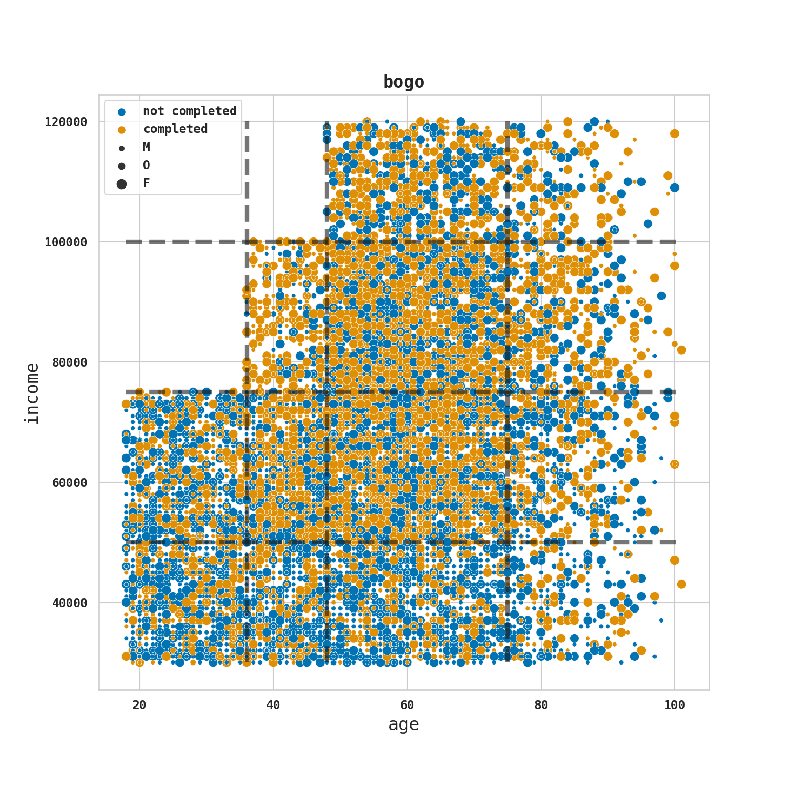
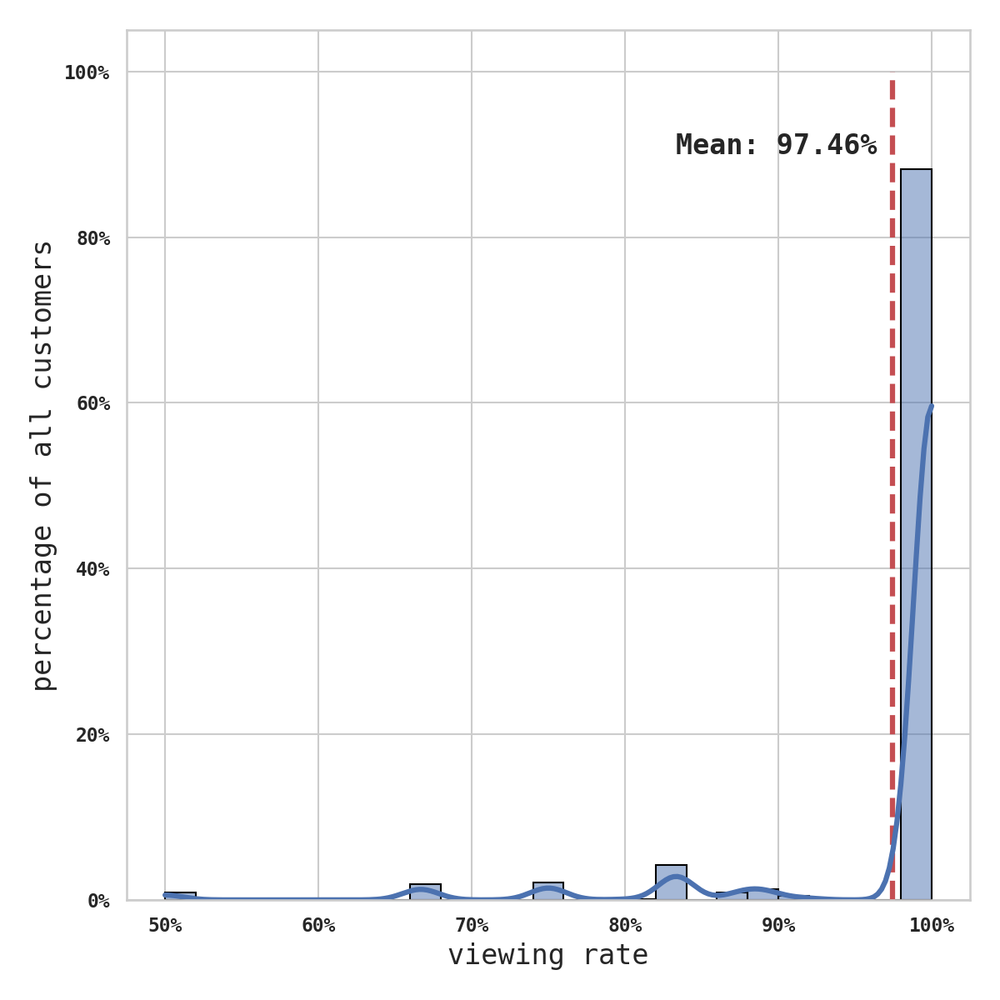
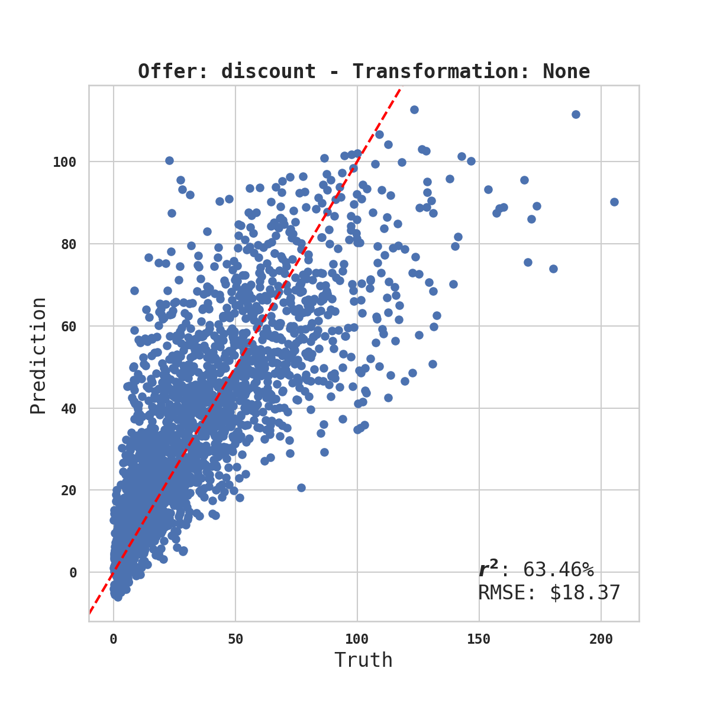
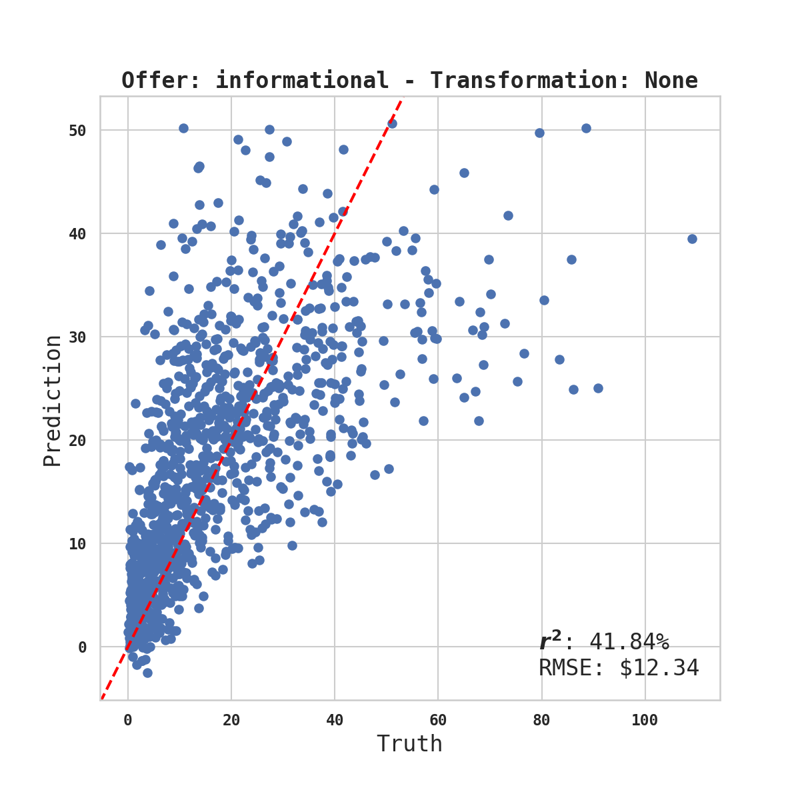
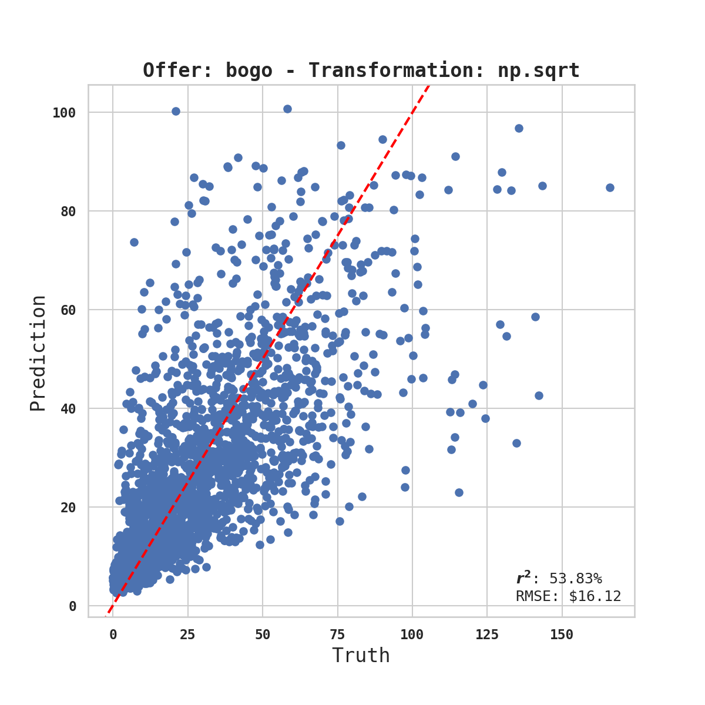
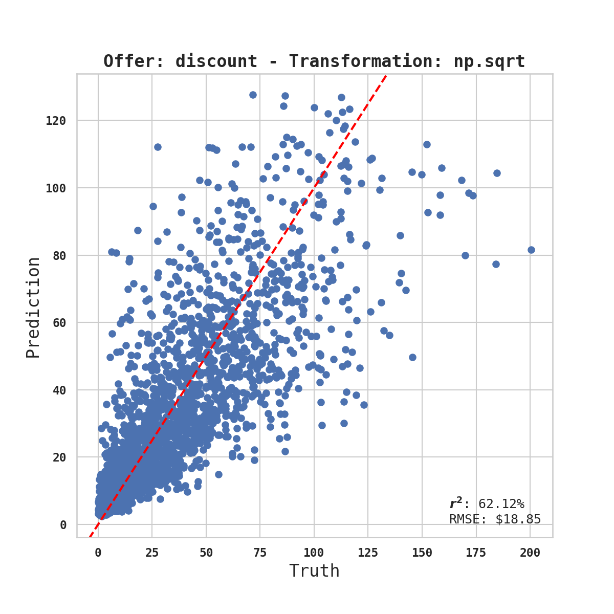
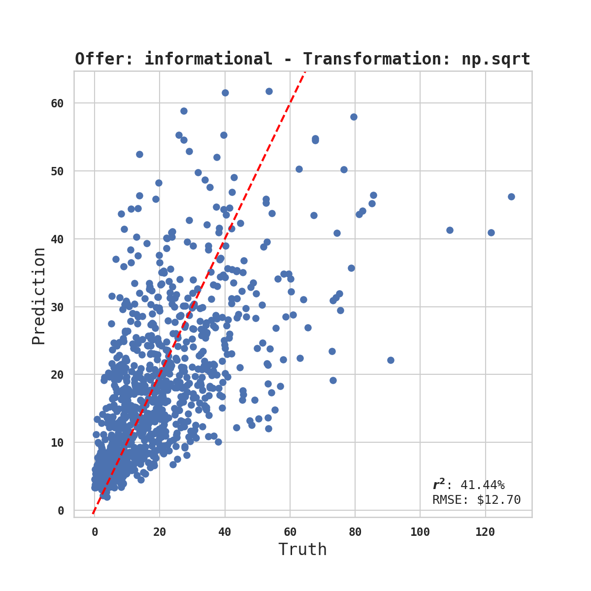
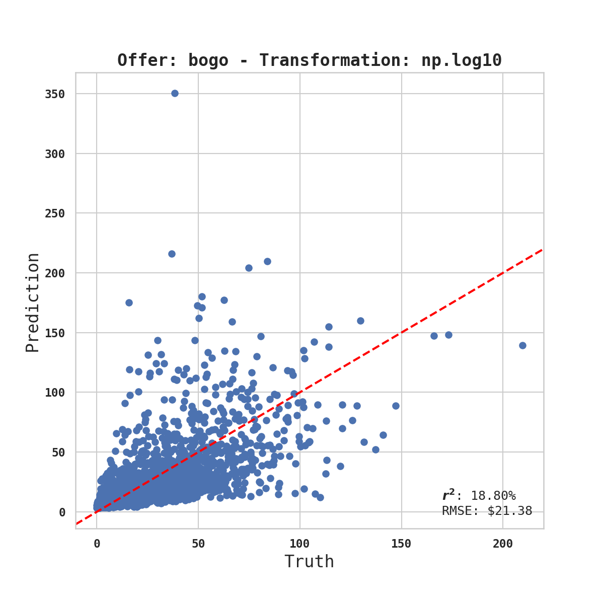
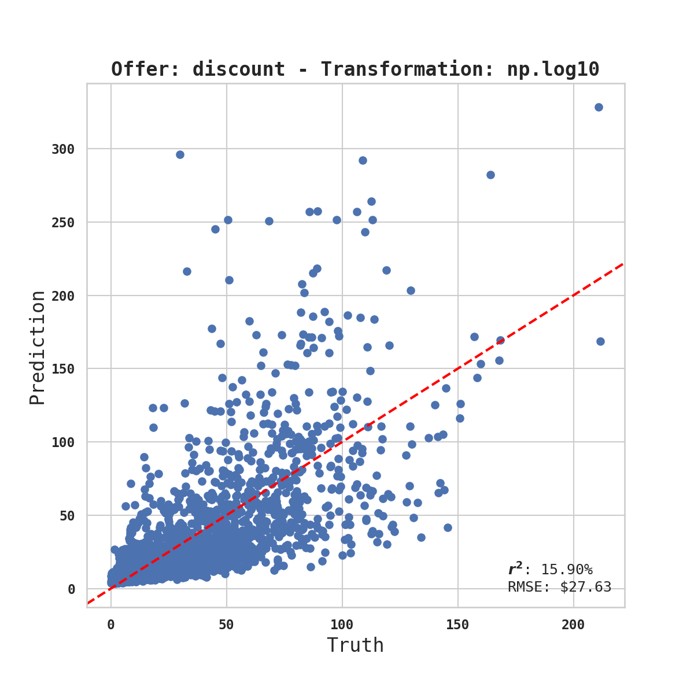
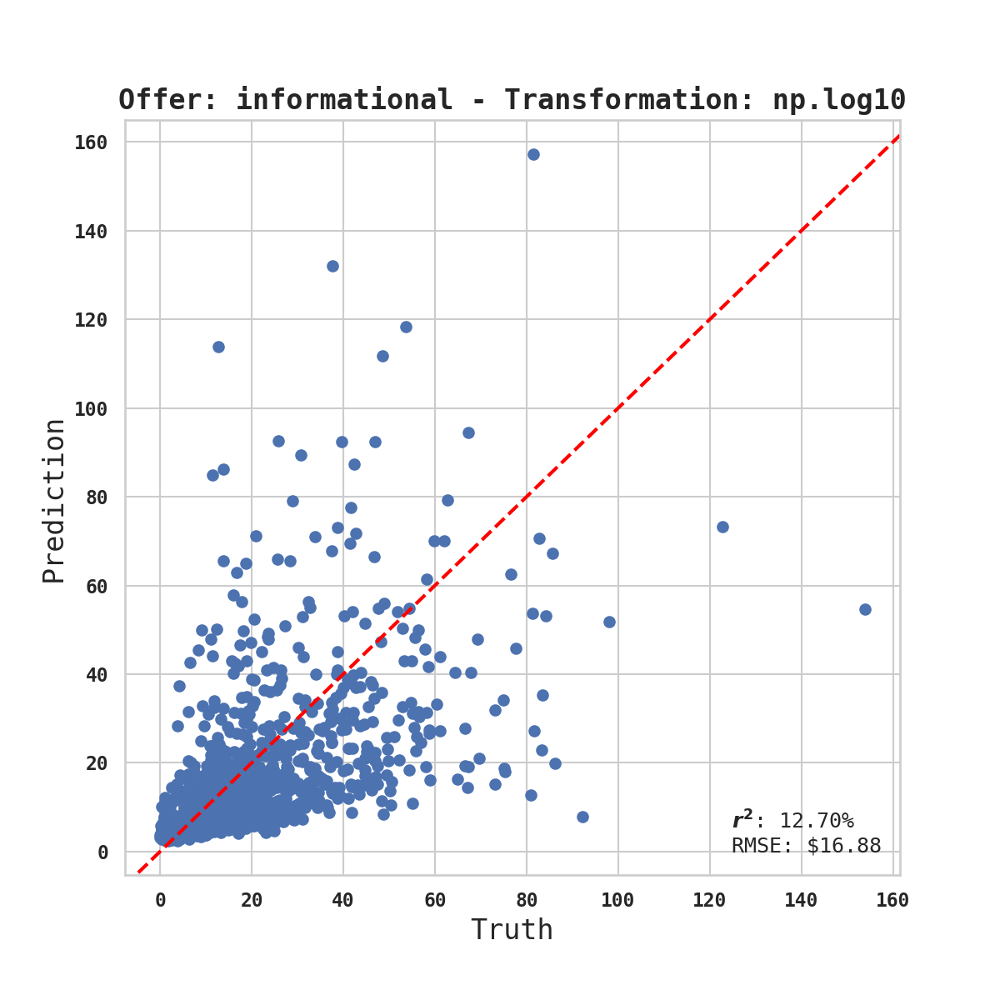

    

Photo by <a href="https://unsplash.com/@photographybyniels?utm_source=unsplash&amp;utm_medium=referral&amp;utm_content=creditCopyText">Niels Kehl</a> on <a href="https://unsplash.com/s/photos/starbucks?utm_source=unsplash&amp;utm_medium=referral&amp;utm_content=creditCopyText">Unsplash</a>

    

        
    

    

        <h1 style="font-weight:bold;">Summary</h1>
        
In this exercise on simulated data of Starbucks marketing offers, the task was to identify which offer customers like best. I extracted relevant brackets of demographics and presented actionable conversion rates for each offer type. The effort to present a more granular quantification of the customers' performance in terms of spending for each offer was tempered by the sparsity of data and the relatively small number of available features.

    

---
# Project Definition
## Project Overview

In the final project for my DataScience degree at [Udacity](https://www.udacity.com/course/data-scientist-nanodegree--nd025), I had access to a data set containing simulated data that mimics customer behavior on the Starbucks rewards mobile app. Such dataset are used to test different algorithms aiming to extract customers preferences (You can find a short description of the poject by a Data Scientist at Starbucks [here](https://youtu.be/bq-H7M5BU3U)).

The task is rather broadly define as:
> _... combine transaction, demographic, and offer data to determine which demographic groups respond best to which offer type_

In this work, I will use this dataset as intended and present an exploratory analysis aimed at discriminating relevant group of customers and the way they interact with the different offers presented to them.

## Problem Statement

Over 30 days, Starbucks sends out 0 to 6 offers to users of the mobile app. An offer can be merely an advertisement for a drink (called `informational` offer) or an actual offer such as a `discount` or `bogo` (buy one get one free).

Associated with the time-line of events for all participants, came the demographic profile of each individual with details on their `gender`, `age`, `income`, the date their profile was registered on the app (`become_member_on`).

The goal of the following analysis is to establish subgroups of customers characterized by age, gender, date of registration, and income according to their preferential treatment of certain offers.

## Metrics

In the picture below (Figure 1) you'll find the time-line of events for one customer. You'll see 4 offers (3 `bogo` and 1 `discount`). All offers have specific durations (in this example: 7, 3, 7, and 5 days respectively). they also have a different level of difficulty or an amount that needs to be spent to be rewarded.

To give an example, a user could receive a `discount` offer _buy 10 dollars get 2 off_. The offer is valid for 10 days from receipt. If the customer accumulates at least 10 dollars in purchases during the validity period, the customer completes the offer. In the case of `bogo` offer, the completion is achieve once the product is purchased. The completion is therefore clearly identified for these 2 offer types (marked with yellow lines in Figure 1). There are no completions identified for the `informational` offer.

First, I considered how customers responded to the offers by simply looking at the number of time an offer received was viewed. Since each customer could receive the same offer more than once I computed a __viewing rate__ to identify if some subgroup were not interacting much with the mobile app.

For simplification purpose but also due a large number of missing data in each sub-offers, I decided to aggregate the results by offer type

Then, I focused on analyzing how customers were reacting once they viewed the offer. For that a marker of completion is necessary. The completion is straightforward for the `bogo` and `discount` offers, and I counted the number of completion only after an offer was viewed. For simplification purpose but also due a large number of missing data in each sub-offers, I decided to aggregate the results by offer type (`bogo` and `discount` only). I then computed an __completion rate__ per offer type.

In an exploratory approach, decided to visually explore the relationship between completion (for `bogo` and `discount` only) and the limited amount of customer demographics, namely, gender, age, date of registration, and income. From these observations, I extracted relevant brackets for each category and compare the conversion rate for each possible group.

Finally, I tried to improve the analysis by adding a linear regression of the __amount spent__ during the remaining duration of an offer after the offer is viewed by the customer. Such model should give us a better understanding of the performance of each offer. Since this approach does not rely on completion I was able to extend the analysis to all offer types: `bogo`, `discount`, and `informational`.

# Analysis
## Data Exploration & Visualization

### The `profile.json` dataset
Rewards program users (17000 users x 5 fields)
- gender: (categorical) M, F, O, or null
- age: (numeric) missing value encoded as 118
- id: (string/hash)
- became_member_on: (date) format YYYYMMDD
- income: (numeric)

The `profile.json` dataset presented 17,000 customers but required the removal of customers with missing details that were clearly identified with the an age of 118. After filtering only 14,825 unique customers were available for the rest of the analysis. This dataset also required a conversion of `became_member_on` into a date format which was easily achieve once loaded as a pandas DataFrame. The modified dataset was stored in a DataFrame named `PROFILE`.

### The `portfolio.json` dataset
Offers sent during 30-day test period (10 offers x 6 fields)
- reward: (numeric) money awarded for the amount spent
- channels: (list) web, email, mobile, social
- difficulty: (numeric) money required to be spent to receive reward
- duration: (numeric) time for offer to be open, in days
- offer_type: (string) bogo, discount, informational
- id: (string/hash)

The `portfolio.json` dataset provided details about each specific offer that could presented to the customers. The variable `channel` presented the channel via which the customers would received an offer (web, email, mobile, or social). I expanded this column into 4 columns for each channel type, marking the channel as active with `1` and inactive as `0`. Since all offers were presented via email, this column was removed. Finally, since the `offer_id` was not easily identifiable, I created a code for each offer to have better readability of `offer_type`, `duration`, and `difficulty`. For instance, the offer `f19421c1d4aa40978ebb69ca19b0e20d`, a `bogo` offer which required to spent \$5, and lasted for 5 days, became; `B.05.05`. The modified dataset was stored in a DataFrame named `PORTFOLIO`.

### The `transcript.json` dataset
Event log (306648 events x 4 fields)
- person: (string/hash)
- event: (string) offer received, offer viewed, transaction, offer completed
- value: (dictionary) different values depending on event type
- offer id: (string/hash) not associated with any "transaction"
- amount: (numeric) money spent in "transaction"
- reward: (numeric) money gained from "offer completed"
- time: (numeric) hours after start of test

After inspection of only the 14,825 customers remaining, I identified from the `transcript.json` dataset 5 customers that did not received any offer. I also identified 333 customers that did not make any transactions over the course of the 30 days of observations. I decided to remove these individuals from the rest of the analysis and keep only 14,487 customers.

### Creating targets and features
By iterating through the customer of this event log I gathered the total amount of money spent over 30 days as `total_spending`, and the total amount of offers received as `total_offers` for each individual. These 2 variables were added to `PROFILE` to be used as features later.

By iterating through all the offers received by customer, I gathered the amount of money spent after being viewed as `amount_viewed`, the view status as `view_tag` (0: not viewed, 1: viewed), and the completion status as `completed_tag` (0: not completed, 1:completed). I stored these variables along with the `offer_id`, and the `profile_id` in the DataFrame named `RES`.

#### _Time-line_
For the generation this main metric table `RES`, I created a visualization of the time-line of event (Figure 1) to better understand how to assign the transactions to specific offers. This visualization was also useful to test and verified the implementation of the analysis.

    

        
        

        Figure 1. Timeline of events for one customer. Red lines represent the reception of an offer. Blue lines represent the moment the offer was viewed. Yellow lines show when an offer was completed. Black lines (solid and dashed) represent the occurrence of a transaction.
        

    

 

#### _Offer distribution_
The Figure 2 shows that all offer were evenly presented (~10% each) through of the dataset. This means that by considering only <code>bogo</code> and `discount` offers in a first analysis, 80% of the offer received (40% for `bogo` and 40% for `discount`) were accounted for.

 

    

        
        

        Figure 2. Distribution of each offer. The transcript of event was evenly split with each offer represented 10% of all offer received.

    

 

  

#### _Missing Values per Offer_
Since just few offers are presented to the customers, it was clear that the metric table would concentrate a lot of missing values. When I look closely at the missing values rate for each offer (Table 1) I found that about 63% of the offer received presented missing values in any offer. By aggregating offers by offer type the rate of missing values decreases drastically. This is another argument to consider only `bogo`, `discount`, and `informational` in the analysis.

Table 1. Missing values rates for all offers (left) and aggregated offer types (right)

    

        
    

    

        
    

#### _Offer Completion_
I considered a conversion when an offer was completed only after being viewed. The median conversion rate for the `bogo` offers was only 33.3%  but 50.0% for `discount`. I chose to label customers as successful at converting the offer if they showed a 50% or higher conversion rate.

    

        
        

        Figure 3. Completion rates distribution for <code>bogo</code> (left) and <code>discount</code> (right).
        

    

I decided to explore visually the distribution of the conversions over the different demographics looking at income vs. age (Figure 4), age vs. registration date (Figure 5, left), and income vs. registration date (Figure 5, right).

    

        
        

        Figure 4. Customers age vs. income. The orange dots represent the customers that completed the <code>bogo</code> offers and blue dots represent customers that did not complete the offers. The size of the dots represents the gender of the customers.
        

    

    

        
    

    

        
    

Figure 5. Registration date vs. Age (left panel) and Registration date vs. Income (right panel) for the <code>bogo</code> offers.

Figure 4, and Figure 5 represent only the `bogo` offers, but similar patterns can be seen for the `discount` offers. These scatter plots show rather clear "brackets" in the different categories:
 - __age breaks__ can be seen at 36 (first income break), 48 (second income break), and 75 years of age (thinning of the population).
 - __income breaks__ can be seen at 50k (increase in the number of conversions), 75k, and 100k
 - __registration breaks__ be seen August 1st 2015, and August 1st 2017. Both dates show large increases in registration.

I used these brackets to break down the profile into a limited amount of categories that enabled me to extract conversion rate per relevant subgroups.

#### _Amount spent per offer_

In an alternative approach, I tried to use the amount spent per offer once viewed as the target variable for regression based on the available demographics features. In that regard, I explored the distribution of the total spending over 30 days (Figure 6) to filter out outlier behaviors. I decided first to remove all customers that did not spent more than $5 over 30 days. Looking at the distribution of total spending, I also filter out _high spender outliers_ by using the traditional definition of outliers as:

     ,

 
where Q3 represents the third quartile (75% of the population) and IQR represent the Interquartile Range, Q3 - Q1 (Q1: 25% of the population). In the case of the total spending for this upper limit is $355.63.

    

        
    

    

        
    

Figure 6. Distribution of the total spending over 30 days before (top panel) and after filtering (bottom panel).

    

        
        
Figure 7. Distribution of the amount per viewed offer according to the completion status for <code>bogo</code> and <code>discount</code>

    

    

    
<h5>Metric validation</h5>After filtering I wanted to test if the amount spent would be a able to reflect the offer completion as defined above. I applied a t-test to compare the amount spent per offer viewed for customers considered successful at completing offers and customers that are not.

    
In both <code>bogo</code> and <code>discount</code> the probability of the groups to be similar was largely below 5%. We can then consider that the groups are significantly different for one another in the amount they spent per viewed offer.

    

The distribution of the amount spent per offer viewed appears to be be skewed, which can impact negatively the regression model (Figure 8). I tested a square root and log10 transformation and tested their impact on the model.

    

        
        
Figure 8. Distribution of amount spent per offer viewed (left panel) with <code>sqrt</code> (middle panel), and <code>log10</code> (right panel) transformations.

    

<!-- > Features and calculated statistics relevant to the problem have been reported and discussed related to the dataset, and a thorough description of the input space or input data has been made. Abnormalities or characteristics about the data or input that need to be addressed have been identified. -->

# Methodology
## Data Preprocessing
The filtering and formatting steps taken for the exploration of data were explained in the previous section.

Regarding the regression model few steps were implemented:
1. Converting the date into a Unix timestamp (in seconds). This allowed to use the registration date as a continuous variable better suited for a linear regression.
2. Encoding of the `gender` in integers (with sklearn's `OneHotEncoder()`).
3. All features were scaled according to their median and IQR to decrease the effect of outlier values (with sklearn's `RobustScaler()`)  

The step #1 was implemented in `data_modeling.filter_by_offer()`. Steps #2 and #3 were implemented in `data_modeling.build_model()` and integrated into the pipeline that fed a grid search to estimate the best performance and the best model paramaters.

> All preprocessing steps have been clearly documented. Abnormalities or characteristics about the data or input that needed to be addressed have been corrected. If no data preprocessing is necessary, it has been clearly justified.

## Implementation
The analysis was contained in a jupyter notebook calling few modules located in the `./code/` directory and describe below.

### `data_wrangling.py`:
This module contains general functions use for data manipulation:
- `load_data()`: loads, filters and formats the portfolio, profile, and transcript datasets.
- `expand_transcript()`: expands the dictionary contained in transcript containing _offer_id_, _amount_, and _reward_.
- `create_features()`: creates the classes for each category of the profile dataset according to the brackets identified in Figures 4 and 5.
- `load_from_db()`: loads the metric table and the filtered and updated profile dataset from tables in the `db_results.db` SQL database located in the `./data/` directory. This was implemented to avoid running the analysis on the full transcript during development.

### `data_visualization.py`:
This module contained only `time_line()` function to generate time-line visualization such as Figure 1.

### `starbucks_class.py`:
This module contains the 2 classes necessary to run the analysis.
- `Person()`: Object representing a customer characterized by its _id_, the _data_ associated to this customer, the _offers_ that it received, and the sum of all transactions or _total spending_. 2 methods are associated to this object:
    - `get_transaction()`: pandas dataframe of all transactions between 2 hours of the records.
    - `get_reward()`: pandas dataframe of all rewards between 2 hours of the records.
- `Event()`: Object representing a received offer characterized by all details of the offer (see repository for details), and specifically the time of reception (_viewed_) and the time of completion (_completed_) that were crucial in the establishment of the viewing status, completion status, and the extraction of the amount spent by offer viewed.

### `data_modeling.py`:
This module is dedicated to the linear regression model of the amount spent per viewed offer.
- `filter_by_offer()`: creates Features (X) and target (y) for a specific offer
- `build_model()`: encodes and scales X, normalizes y and creates pipeline for a Ridge regressor. A grid search systematically tested *alpha*, *max_iter* and *tol* of the model with 5-fold cross-validation.
- `evaluate_model()`: creates evaluation metrics for the model. I considered the r2 or *variance explained*, the *Mean Absolute Percentage Error* and the *Mean Absolute Error*
- `run_model()`: runs all the steps of the model and represents the predicted values vs. true values.

> The process for which metrics, algorithms, and techniques were implemented with the given datasets or input data has been thoroughly documented. Complications that occurred during the coding process are discussed.

## Refinement
I recalibrated several times the creation of model. I realized that the filtering by *total_spending* was improving the model. This process was empirical, but I tried to follow the traditional definition of outliers.

In a more systematical way, I tested, as mentioned above, several normalization functions to improve the model based on the observation of not normal distribution of the amount_viewed variable. The choice of the final normalization was driven by the *variance explained* achieved with each normalization.

# Results
## Evaluation, Validation, & Justification

### Viewing Rate

- 88% of the 14,487 customers viewed all the presented offers,
- 99% of them viewed over 66% of the presented offers,
- 100% of the customers viewed at least 50% of the presented offers.

    

        
Table 2. Viewing rate per offer

        
    

    

        
        
Figure 9. Distribution of viewing rate across all offers

    

With an average viewing rate of 97.46% across all offers (Table 2), I concluded that all customers interacting positively with all offers. I did not push forward the discrimination of customers upon viewing rate but focused the analysis on the conversion from viewing an offer to completing an offer.

### Conversion Tables
As mentioned above, I segregated the customers' demographics into brackets and computed the conversion rate for each group. I also computed the cumulative total spending for each category, to assess the importance of each sub-group in the analysis. Throughout the 144 sub-groups, the maximum `total_spending` was \$ 151,850.52 with a median `total_spending` of \$ 1,938.09.

<!-- Looking first at the top 10 conversion rates ordered for the `bogo` offers (Table 3), we can see that the first 7 groups have perfect conversion in both `bogo` in `discount` but represent relatively small `total_spending`.

    

    Table 3. Top 10 conversion rates ordered by <code>bogo</code> offer.
    

    

 -->

The top 10 conversation rates by `total_spending` (Table 3) show that the age group 48 to 74 years old is the group that spent the most over the 30 days of observation. If the difference in conversion between `bogo` and `discount` is relatively small for the top 3, we can see interesting differences appear after the 4th row. For instance, the group of 48 to 74 years old male customers, that became member between August 2017 and August 2018 with an income ranging from 50k to 74k (Table 3, row #5) show a conversion rate below 50% but seem to favor the `discount` offers.

    

        

        Table 3. Top 10 conversion rates ordered by <code>total_spending</code>.
        

        
    

The top 10 conversion rates by the largest difference between `bogo` and `discount` (Table 4) is probably the table that would yield the best insights on how to drive future interventions. In that regard, the 48 to 74 years old female customers that became members between July 2013 and August 2015 with an income below 50k (Table 4, row #6) do not seem interested in the `bogo` offers but convert about 52% of the `discount` offers.

    

        

        Table 4. Top 10 conversion rate ordered by maximum percentage points difference between <code>bogo</code> and <code>discount</code>.
        

        
    

### Linear Regression Model
In an attempt to provide a quantifiable, granular understanding of the spending habits of the customers and to predict the impact of each offer type on new customers, I tried to model the amount of dollar spent by offer type according to the limited number of features at my disposal (age, gender, date of registration, and income). I added the individual total spending over 30 days as a feature and tested the relevance of a linear regression.

The grid search testing consistently showed best performance for a Ridge regression with the following parameters:

|parameter|value |
|:--------|:----:|
|alpha    | 0.1  |
|max_iter | None |
|tol      | 0.001|

The Figure 10, 11, and 12 show the scatter plots of true values versus predicted values of amount spent for viewed offers for respectively, no transformation, a `sqrt` transformation, and a `log10` transformation. After review, the models with no transformation performs slightly better than the other transformations despite the skewness of the original data.

    

        
    

    

        
    

    

        
    

Figure 10. True values versus predicted values of amount spent for viewed offer with no transformation

    

        
    

    

        
    

    

        
    

Figure 11. True values versus predicted values of amount spent for viewed offer with a <code>sqrt</code> transformation

    

        
    

    

        
    

    

        
    

Figure 12. True values versus predicted values of amount spent for viewed offer with a <code>log10</code> transformation

Unfortunately, after testing several tunings of data filtering, normalization, and model parameters it appears that a linear model yielded rather poor predictions: the best model was found for the `discount` offers, but only about 63% of the variance of the test dataset was explained by our predicted values of spending.

> If a model is used, the following should hold: The final model’s qualities — such as parameters — are evaluated in detail. Some type of analysis is used to validate the robustness of the model’s solution.

> Alternatively a student may choose to answer questions with data visualizations or other means that don't involve machine learning if a different approach best helps them address their question(s) of interest.

>The final results are discussed in detail.
Exploration as to why some techniques worked better than others, or how improvements were made are documented.

# Conclusion
## Reflection
The exploratory approach was rather effective to provide insights on the conversion rates of selected subgroups, but only for the `bogo` and `discount` offer types. The top 10 conversion rate tables are probably a good first step in the direction of improving the delivery of these offers.

It is important to note that this approach was possible because of the very small amount of features available which enable a visual inspection of the relationships between customers and offers. It is also possible that the program simulated the data created strong patterns easily identifiable, which could explain the almost perfect distribution of missing data in each offer type, or the very salient breaks in the different demographics, as can be seen in income vs. age (Figure 4).

>Student adequately summarizes the end-to-end problem solution and discusses one or two particular aspects of the project they found interesting or difficult.

## Improvement
The general task of finding _" which demographic group responds better to which offer "_ was rather broad. I am sure that discussing further the goals to be achieved with the relevant Starbucks team would have greatly improved the definition of relevant metrics, and would have lead to the construction of a better model of the data.

>Discussion is made as to how at least one aspect of the implementation could be improved. Potential solutions resulting from these improvements are considered and compared/contrasted to the current solution.

 

_find the full analysis [there](https://github.com/6one2/StarbucksChallenge)_

<!-- css style -->

